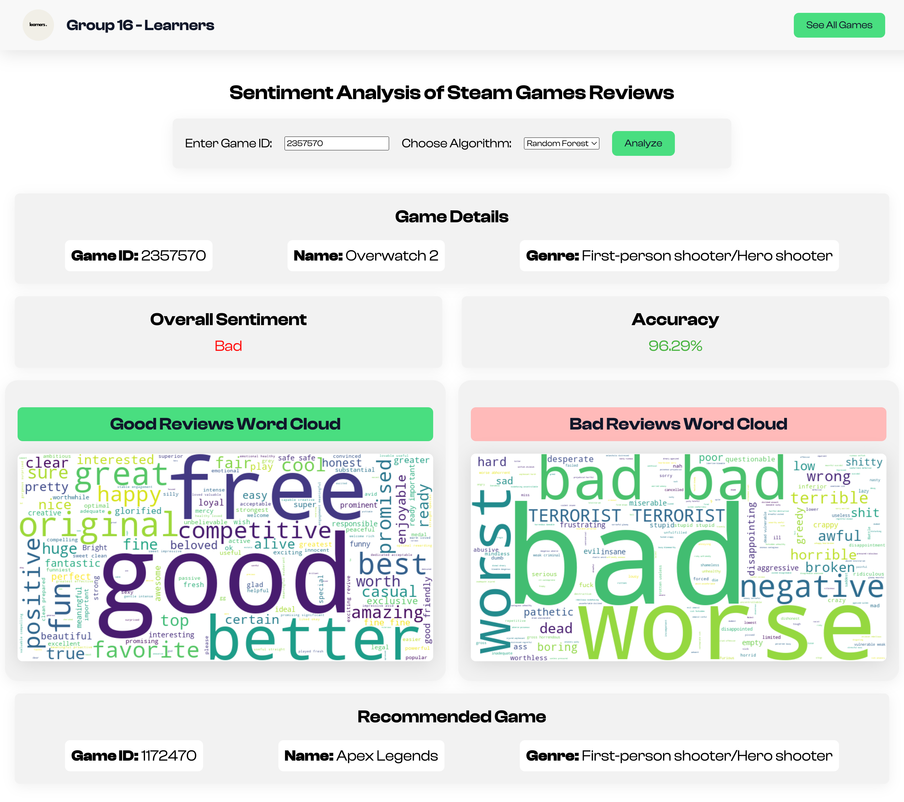

# Steam Games Sentiment Analysis



## Project Overview

This project performs sentiment analysis on Steam game reviews. It allows users to search for games by either game ID or game name and provides an overall sentiment summary of the reviews. If the sentiment of a game is negative, it dynamically recommends other games from the same genre with positive sentiment.

## Features

- Search for games by game ID or game name.
- Display overall sentiment summary based on user reviews.
- Generate word clouds for positive and negative reviews.
- Dynamic recommendation system suggesting games from the same genre with positive sentiment if the searched game's sentiment is negative.

## Technologies Used

- Django
- scikit-learn
- Natural Language Toolkit (NLTK)
- HTML/CSS
- JavaScript
- Bootstrap

## Project Structure

- `SteamGameSentiment/`: Django project directory
  - `settings.py`: Django settings file
  - `urls.py`: URL routing file
- `sentiment/`: Django app directory
  - `models.py`: Database models
  - `views.py`: View functions
  - `forms.py`: Forms for user input
  - `templates/`: HTML templates
    - `search.html`: Template for searching games
    - `sentiment.html`: Template for displaying sentiment analysis and recommendations
  - `static/`: Static files (CSS, JS, images)

## Installation

1. Clone the repository:
   ```bash
   git clone https://github.com/Ashik-Al-Habib/SentimentAnalyzer.git
   cd SteamGameSentiment
   ```
2. Create a virtual environment and activate it:
  ```bash
  python -m venv .venv
  source .venv/bin/activate
  ```
3. Install the required dependencies:
  ```bash
  pip install -r requirements.txt
  ```
4. Apply the migrations:
  ```bash
  python manage.py migrate
  ```
5. Run the development server:
  ```bash
  python manage.py runserver
  ```
6. Open your browser and navigate to http://localhost:8000/ to use the application.

## Usage

1. Search for a Game: Enter a game ID or game name in the search field and click "Analyze".
2. View Sentiment Analysis: The app will display the overall sentiment of the game based on the reviews. It will also show word clouds for positive and negative reviews.
3. Get Recommendations: If the overall sentiment of the game is negative, the app will recommend other games from the same genre with positive sentiment.

## Contact

For any questions or inquiries, please contact:
- Ashik Al Habib
- Email: habib62@uwindsor.ca


